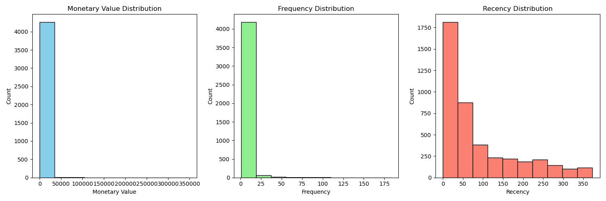
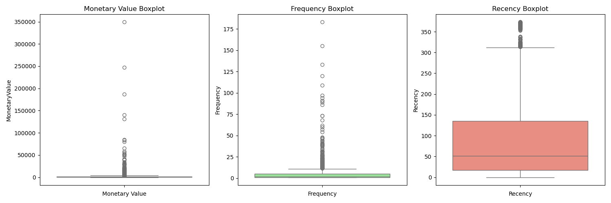
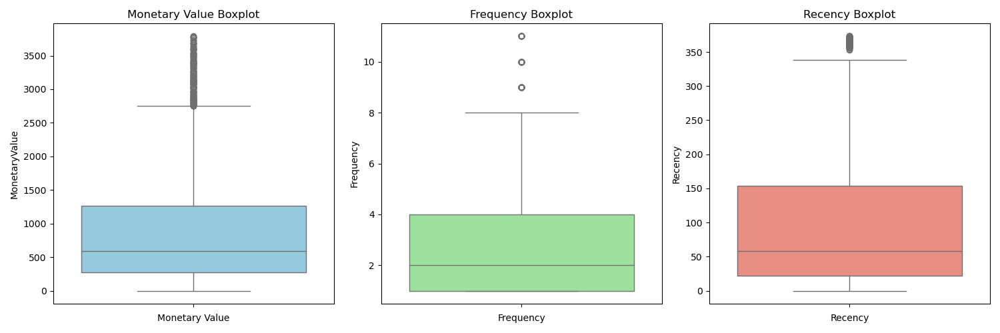
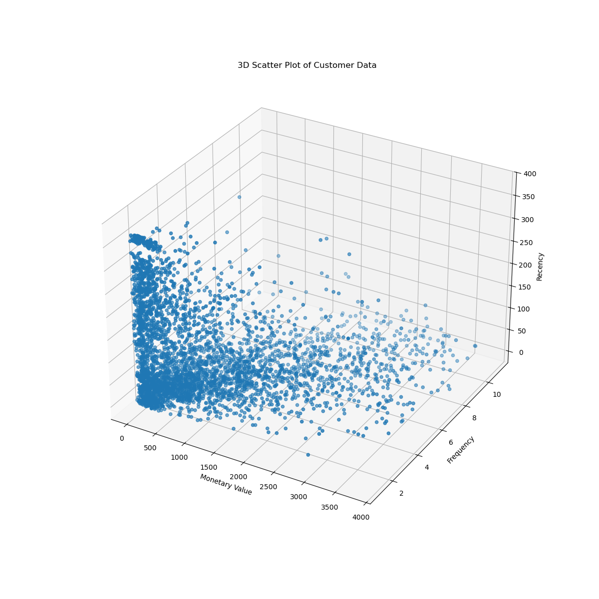
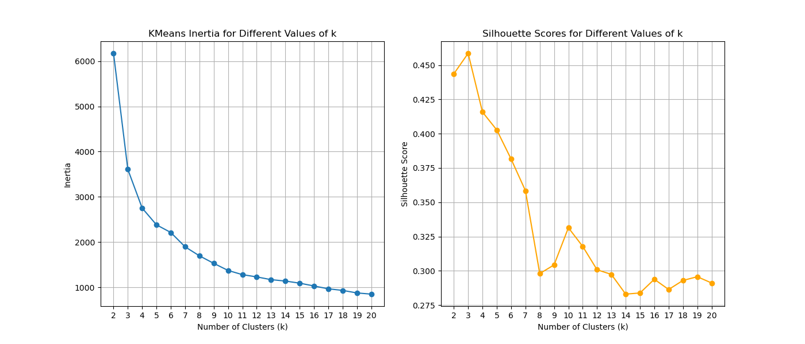
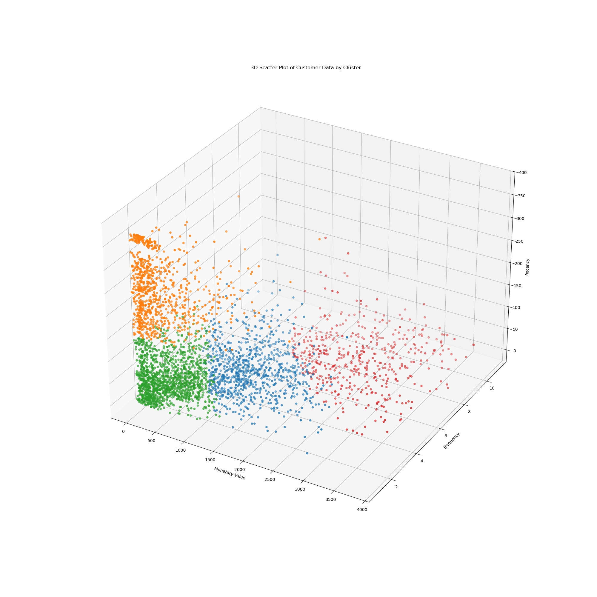

# online_retail_data_clustering

## Description

EDA (Exploratory Data Analysis) and KMeans Clustering on online retail dataset.

## data distribution

## Outliers in Aggregated Data

## Data after removing Outliers

## 3D Scatter Plot (Monetary Value[x], Frequency[y], Recency[z])

## 3D Scatter Plot of scaled data (Monetary Value[x], Frequency[y], Recency[z])

## Silhoutte score calculaton for different values of k (to check the optimal number of clusters)

## Final Cluster of Customer Data

